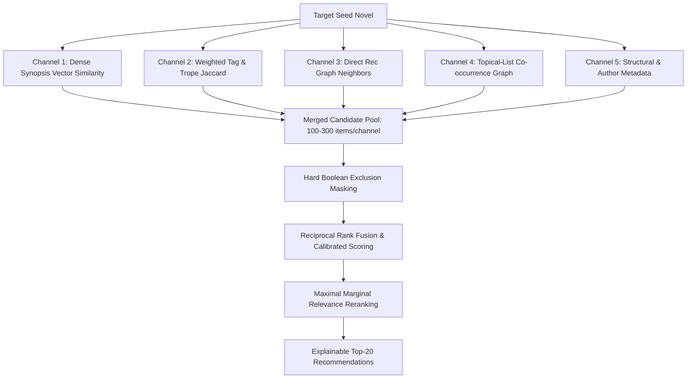

# Novel Updates Recommendation Engine — Comprehensive Product & Technical Plan

## 1. Problem Statement & Core Objective

Novel Updates is a central database for translated Asian web novels, but its native discovery and recommendation capabilities are severely limited. 

Users frequently complain:
> *"Novel Updates has bad recommendations, and broad genres/tags make it hard to find novel experiences similar to a specific favorite."*

Broad categories like *Fantasy*, *Action*, or *Romance* return thousands of structurally different stories. Rating ranks favor heavily promoted bestsellers, direct recommendation links are sparse and unweighted, and newer titles are completely absent from older static datasets (such as `shaido987/novel-dataset`, last updated August 2025).

The primary objective of this project is to build a **human-curated novel-to-novel relationship engine** that:
1. Takes one or more novels a reader liked.
2. Returns highly relevant, explainable recommendations based on subtle premise, trope, character dynamic, tone, and curator evidence.
3. Surfaces "hidden gems" (quality novels buried by popularity algorithms).
4. Strictly respects negative user preferences (e.g., *Exclude Harem*, *No Romance*, *Smart Protagonist only*).
5. Provides verifiable, fact-backed explanations for every recommendation.

---

## 2. Catalog Acquisition & Rescraper Architecture

### 2.1 Dynamic WordPress AJAX Endpoint Scraping
Novel Updates uses WordPress and relies heavily on asynchronous AJAX requests (`wp-admin/admin-ajax.php`) to render tabs and relationship sections. Relying solely on static novel page HTML (`/series/<slug>/`) will miss critical relationship data.

The scraper will query both canonical HTML pages and dynamic AJAX endpoints:
- **Canonical Novel Page** (`GET /series/<slug>/`): Title, associated names, cover, synopsis, author, genres, tags, publication year, original/translated chapter counts, translation status.
- **Direct Recommendations Endpoint** (`POST /wp-admin/admin-ajax.php` with `action=show_recom`): Pairwise recommended titles, vote counts, user comments per recommendation.
- **User Reviews & Rating Breakdown Endpoint** (`POST /wp-admin/admin-ajax.php` with `action=show_rev` / `action=show_rating`): Detailed rating distributions, Bayesian confidence inputs.
- **Curated Recommendation Lists** (`GET /viewlist/<list_id>/` & dynamic page AJAX): List title, description, tags, curator profile, follower count, ordered item list, per-item curator comments, and custom rating tiers (e.g., S-tier / A-tier).

### 2.2 HAR Inspection & Session Fixtures
The repository includes `www.novelupdates.com.har`, containing captured browsing traffic.
- **Offline Fixture Extraction**: The HAR will be parsed offline to extract exact HTTP headers, payload key names, parameter formats, and sample HTML/JSON responses into `tests/fixtures/`.
- **Security & Privacy Guarantee**: All credentials, session cookies, nonces, and private tokens will remain local, excluded from Git via `.gitignore`, and stripped from logs/documentation.

### 2.3 Targeted Discovery Strategy & Closed 2-Hop Neighborhood PoC
Instead of naively crawling all 30k+ public recommendation lists, the discovery engine will prioritize:
1. **Curated Seed Lists**: User-highlighted lists including `cbboss` hidden gems and targeted topical lists (`83544`, `94083`, `83473`, `115510`).
2. **High-Value Lists**: Public lists with $\ge 50$ followers, $\ge 5$ items, and non-empty item descriptions.
3. **Closed 2-Hop Neighborhood PoC Expansion**: To prevent edge sparsity during initial proof-of-concept testing (500–1,000 novels), the crawler will perform a closed 2-hop neighborhood expansion:
   - *Hop 0*: Seed novels and seed recommendation list novels.
   - *Hop 1*: All direct recommendations and list co-occurrence items connected to Hop 0.
   - *Hop 2*: High-confidence edges connected to Hop 1.
   Only novels within this closed subgraph will be crawled during the PoC slice to ensure high edge density.

### 2.4 Resilient, Safe Scraping Mechanics
- **Concurrency & Delays**: Low concurrency (1–2 workers), random delays (1.5s–3.0s between requests).
- **Local HTTP Caching**: Every response is cached locally in compressed storage before parsing. Re-running parsers does not hit the network.
- **Checkpointing & State Recovery**: The crawl queue is stored in SQLite. Every request logs status: `complete`, `partial`, `failed`, or `aborted`.
- **Anti-Bot & Error Handling**: Detects CAPTCHA, Cloudflare challenges, or HTTP 429/403. Immediately halts execution rather than attempting bypass.

---

## 3. The Multi-Channel Relationship Engine

The core engine represents novels as nodes in a multi-relational graph enriched with dense vector embeddings and structured metadata.



### 3.1 Channel 1: Dense Vector Synopsis Similarity
- Synopsis, title, and premise encapsulate narrative conflict, protagonist situation, and tone.
- **Embedding Model**: `sentence-transformers` (e.g., `all-MiniLM-L6-v2` or `bge-small-en-v1.5`).
- **Retrieval**: Approximate nearest neighbor search (FAISS / in-memory cosine similarity) over vector representations of `[Title + Synopsis + Key Tropes]`.

### 3.2 Channel 2: Weighted Tag & Trope Taxonomy
- Novel Updates tags are noisy. Generic tags (*Fantasy*, *Protagonist*) are down-weighted using Inverse Document Frequency (IDF).
- **Taxonomy Weighting**:
  - *High Weight (1.0)*: Specific trope, protagonist behavior, or relationship tags (`Cunning Protagonist`, `Time Loop`, `Obsessive Love`, `Misunderstandings`, `Female Yandere`, `Self-Sacrifice`).
  - *Medium Weight (0.5)*: Setting & mechanism tags (`Kingdom Building`, `System`, `Academy`).
  - *Low Weight (0.1)*: Broad genres (`Fantasy`, `Action`, `Romance`, `Adventure`).

### 3.3 Channel 3: Direct Recommendation Graph
- Extracts pairwise user-submitted recommendation links.
- **Edge Weighting**:
  - *Mutual Recommendation (A ↔ B)*: High weight (1.0).
  - *One-Way Recommendation (A → B)*: Moderate weight (0.6).
  - *Vote Count / Upvote Ratio*: Scaling multiplier ($\log(1 + votes)$).

### 3.4 Channel 4: Topical-List Co-occurrence & Comment NLP
- **Co-occurrence Graph**: Two novels appearing on the same curated list form an edge weighted inversely by list length ($W_{co} = \frac{1}{\text{list\_length}}$).
- **Curator & Comment NLP**:
  - Extract list title, description, and per-item comments.
  - Apply NLP regex and structured parsing to extract normalized topic-attribute tuples: e.g. `(Protagonist, Male, Smart/Unwilling)`, `(Heroine, Female, Yandere/Obsessive)`, `(Tone, Dark/Regret)`.
  - Tiers (S-Tier, A-Tier) assigned by curators increase item-topic confidence.

### 3.5 Channel 5: Structural & Author Metadata
- Boosts for same author, shared universe, prequel/sequel relations, original language, and similar completion/chapter scope.

---

## 4. Retrieval, Ranking & Score Fusion Architecture

### 4.1 Step 1: Multi-Channel Candidate Retrieval
Retrieve 100–300 candidates independently from each of the 5 channels, preserving which channel surfaced each candidate and its channel-specific rank.

### 4.2 Step 2: Hard Boolean Exclusion Filters
Before scoring or ranking, candidate novels are checked against strict Boolean constraints:
- **Exclusion Filters**: Exclude tags specified by user (e.g. `Harem`, `BL`, `Yuri`, `Netorare`, `Gore`).
- **Status Filters**: Require completed translation, active translation, or minimum chapter threshold if requested.
- **History Filters**: Exclude novels marked as `already_read`, `dropped`, or `not_interested`.

### 4.3 Step 3: Reciprocal Rank Fusion (RRF) & Calibrated Scoring
Linear weighted sums of raw similarity scores fail because cosine vector similarity ($0.4–0.85$), tag Jaccard ($0.0–0.4$), and graph edge counts ($0–50$) have incompatible distributions.

We employ **Reciprocal Rank Fusion (RRF)**:
$$RRF\_Score(d) = \sum_{c \in C} \frac{w_c}{k + r_c(d)}$$
where:
- $C$ is the set of retrieval channels.
- $r_c(d)$ is the 1-indexed rank of candidate $d$ in channel $c$ (if not retrieved by channel $c$, $r_c(d) = \infty$).
- $k$ is a smoothing constant (typically $k=60$).
- $w_c$ is the channel weight.

#### Bayesian Rating Confidence & Hidden Gem Boost
The fused RRF score is adjusted by:
1. **Bayesian Rating Confidence ($WR$)**:
   $$WR = \frac{v}{v + m} R + \frac{m}{v + m} C$$
   where $v$ is vote count, $m$ is minimum threshold (e.g. 25 votes), $R$ is average rating, $C$ is catalog mean rating.
2. **Hidden Gem Novelty Multiplier**:
   When "Hidden Gem Mode" is enabled:
   $$\text{Gem\_Boost}(d) = 1.0 + \gamma \cdot \log_{10}\left(\frac{\text{Max\_Reading\_List\_Count}}{\text{Reading\_List\_Count}(d) + 10}\right)$$

### 4.4 Step 4: Diversity Reranking (Maximal Marginal Relevance)
To prevent the top 20 list from returning 10 nearly identical academy or regression novels, we apply **Maximal Marginal Relevance (MMR)**:
$$\text{MMR} = \arg\max_{d_i \in R \setminus S} \left[ \lambda \cdot RRF(d_i) - (1 - \lambda) \max_{d_j \in S} \text{Sim}(d_i, d_j) \right]$$
where $S$ is the set of already selected recommendations, $R$ is the candidate pool, and $\text{Sim}$ is tag/synopsis overlap.

### 4.5 Step 5: Fact-Based Evidence Explanation
Every output recommendation card includes an explicit, non-hallucinated evidence summary:
- **Premise Similarity**: *"Synopsis vector similarity rank #4 (Similar dark regression premise)"*
- **Shared Tropes**: *"Shared specific tags: Cunning Protagonist, Time Loop, Psychological"*
- **Human Endorsement**: *"Directly recommended by 8 users; co-occurs on 4 curated lists including 'Peak Tragedy & Regret'"*
- **Curator Notes**: *cbboss item comment: 'S-tier female yandere heroine with smart male MC'*
- **Quality & Status**: *"Rating: 4.35 (320 votes) | Status: Completely Translated (245 chapters)"*

---

## 5. Offline Evaluation & Data Leakage Prevention

### 5.1 Benchmark Split Protocol
To validate recommendation quality without self-referential bias:
- **Held-Out Test Set**: 20% of direct recommendation edges and 20% of rec-list items are randomly held out as test targets.
- **Strict Leakage Isolation**:
  1. Remove held-out direct edges from the graph.
  2. Remove held-out list co-occurrence links from channel generators.
  3. Strip curator item comments of target novel titles so vector/text models cannot read the answer.

### 5.2 Evaluation Metrics
- **Recall@K (K=10, 25)**: Fraction of held-out targets successfully retrieved in top K.
- **NDCG@K (K=10, 25)**: Normalized Discounted Cumulative Gain accounting for rank position.
- **MRR (Mean Reciprocal Rank)**: Position of first relevant recommendation.
- **Catalog Coverage**: Percentage of total catalog items recommended across all test queries.
- **Novelty / Hidden Gem Ratio**: Average inverse popularity ($\log_2(\frac{N}{\text{reading\_list\_count}})$) of recommendations.

---

## 6. Technical Stack & File Architecture

### 6.1 Database Schema (SQLite)
- `novels`: `id`, `slug`, `title`, `associated_names`, `author`, `language`, `synopsis`, `rating`, `rating_votes`, `reading_list_count`, `chapters_orig`, `chapters_trans`, `status_trans`, `updated_at`.
- `tags`: `id`, `name`, `category`, `idf_weight`.
- `novel_tags`: `novel_id`, `tag_id`.
- `direct_recs`: `source_novel_id`, `target_novel_id`, `is_mutual`, `votes`.
- `rec_lists`: `id`, `title`, `description`, `curator`, `followers`, `item_count`, `created_at`.
- `rec_list_items`: `list_id`, `novel_id`, `position`, `tier`, `comment`.
- `topics`: `id`, `name`, `keywords`.
- `novel_topics`: `novel_id`, `topic_id`, `confidence`, `source`.
- `crawl_queue`: `url`, `type`, `priority`, `status`, `attempts`, `last_error`.
- `scrape_runs`: `id`, `started_at`, `finished_at`, `status`, `pages_scraped`, `errors`.

### 6.2 Python Package Structure
```text
novelupdatesrecommender/
├── PRODUCT_PLAN.md
├── problemstatement.md
├── .gitignore
├── requirements.txt
├── src/
│   ├── scraper/
│   │   ├── __init__.py
│   │   ├── client.py        # Rate-limited HTTP/AJAX client with caching
│   │   ├── har_parser.py    # HAR fixture analyzer & payload extractor
│   │   ├── html_parser.py   # BeautifulSoup/lxml parsers for novel & list pages
│   │   └── crawler.py       # Closed 2-hop crawl queue manager
│   ├── db/
│   │   ├── __init__.py
│   │   ├── schema.py        # SQLite schema & migrations
│   │   └── repository.py    # DB queries & graph data access
│   ├── nlp/
│   │   ├── __init__.py
│   │   ├── embedder.py      # Sentence-transformers vector generator
│   │   ├── taxonomy.py      # Weighted tag IDF taxonomy
│   │   └── topics.py        # Curator description & comment NLP parser
│   ├── engine/
│   │   ├── __init__.py
│   │   ├── candidate_gen.py # 5-channel candidate retrieval
│   │   ├── filters.py       # Hard boolean preference filters
│   │   ├── rrf_ranker.py    # Reciprocal Rank Fusion & Bayesian scoring
│   │   ├── mmr_reranker.py  # Maximal Marginal Relevance diversity
│   │   └── explainer.py     # Fact-backed evidence generator
│   ├── eval/
│   │   ├── __init__.py
│   │   ├── benchmark.py     # Leakage-free graph splitter & evaluation metrics
│   │   └── baseline.py      # Single-signal baseline models
│   └── api/
│       ├── __init__.py
│       └── main.py          # FastAPI application server
├── web/                     # React + Vite frontend application
└── tests/
    └── fixtures/            # Saved HTML/JSON responses from HAR
```

---

## 7. Phased Implementation Roadmap

### Phase 0: HAR Inspection & Fixture Extraction
- Analyze `www.novelupdates.com.har` locally.
- Save HTML and AJAX JSON response fixtures to `tests/fixtures/`.
- Build offline unit tests for page and AJAX parsers.

### Phase 1: SQLite Store & Resilient Scraper
- Initialize SQLite database schema.
- Implement rate-limited HTTP client with caching and status logging.
- Run closed 2-hop crawl centered around `cbboss` seed lists (`83544`, `94083`, `83473`) and `115510` (500–1,000 novels).

### Phase 2: NLP Features & Tag Taxonomy
- Build synopsis vector embedding engine (`sentence-transformers`).
- Generate tag IDF taxonomy weights.
- Parse rec-list comments and titles into structured topic-attribute tuples.

### Phase 3: Hybrid Retrieval & RRF Ranking Engine
- Build 5-channel candidate generators.
- Implement hard boolean exclusion filters (Harem, BL/Yuri, Romance, translation status).
- Implement Reciprocal Rank Fusion (RRF), Bayesian rating confidence, and MMR diversity reranking.
- Develop fact-based evidence explanation generator.

### Phase 4: Offline Evaluation & Leakage-Free Benchmark
- Build graph-split dataset generator.
- Benchmark Hybrid RRF vs Single-Signal Baselines (Vector-only, Tag-only, Rec-only).
- Tuning and error analysis.

### Phase 5: FastAPI & Interactive Web UI
- Build FastAPI backend endpoints (`/api/search`, `/api/recommend`, `/api/filters`).
- Develop React + Vite web UI with dark mode, rich novel cards, filter controls, hidden-gem sliders, and evidence modal.
