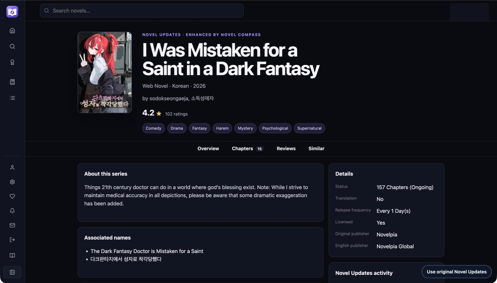
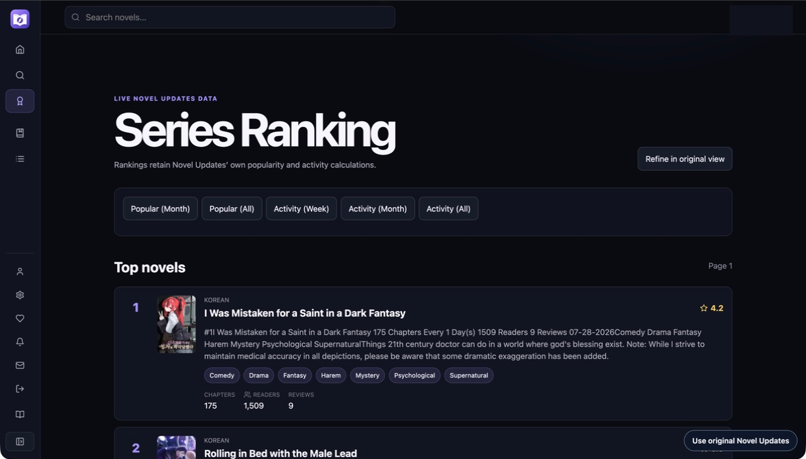
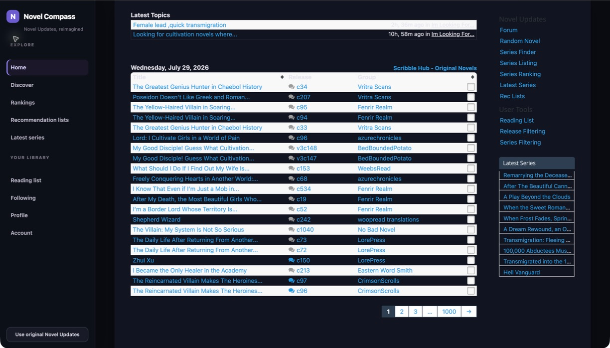

# Novel Compass Chrome Extension

Restyles Novel Updates with Novel Compass navigation while preserving the
site's live links, releases, reviews, rankings, lists, and account actions.

## Screenshots

### Compact series view

The cover, essential metadata, description, and details fit in the first
viewport. Overview, chapters, reviews, and similar titles continue down one
page; the compact section bar provides jump links without hiding content.



### Series rankings



### Latest releases



Screenshots contain page content only. Browser chrome and personal account
details are excluded or redacted.

## Build the lightweight extension

The default build is the Chrome Web Store candidate. It includes all Novel
Updates route restyling, but no recommendation/search snapshot:

```bash
pnpm --dir web run package:extension
```

Then open `chrome://extensions`, enable **Developer mode**, choose
**Load unpacked**, and select:

```text
extension/dist
```

The validated ZIP is written to:

```text
extension/dist/novel-compass-extension.zip
```

The validator enforces the core bundle budgets and rejects `.git`, `.DS_Store`,
source maps, and other packaging debris.

## Deterministic fixture build

Use the three-title dataset for deterministic enhanced-feature tests:

```bash
pnpm --dir web run test:extension
pnpm --dir web run package:extension:fixture
```

## Full offline developer build

The large local snapshot is an explicit developer artifact and is not suitable
for the Chrome Web Store:

```bash
pnpm --dir web run package:extension:offline-full
```

Every build replaces `extension/dist`. The offline copy step excludes nested
Git metadata and packaging debris.

## Local fixture server

For parser and fallback fixture pages:

```bash
pnpm --dir web run fixtures:extension
```

Live Novel Updates testing remains necessary for authenticated chapter,
reading-list, rating, and review behavior. Never save cookies or active session
tokens into repository fixtures.
